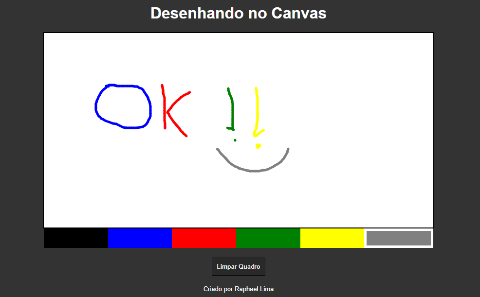

# tela_para_desenho
Esse projeto usa a linguagem JavaScript para simular uma tela para desenhos.

## Minha aplicação:

## Sobre minha aplicação:

Esse sistema captura o momento que o usuário pressiona o mouse dentro da tag canvas e 
cria pequenos pontinhos seguindo as coordenadas do mouse dentro da própria tag enquanto o usuário segura o mouse.
Nesse sistema o usuário pode escolher entre 5 cores diferentes e ainda limpar o quadro  de desenhos quando desejar.

## Por que essa aplicação?

Esse algoritmo foi ensinado pela b7web em seu workshop, nele pude praticar minha lógica de programação, além de aprender o algoritmo de desenho dentro de uma aplicação,
algo não muito comum de programadores saberem. 
